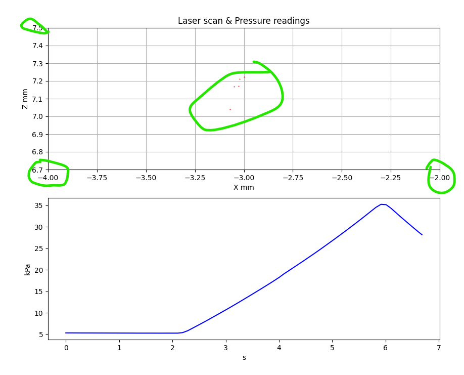
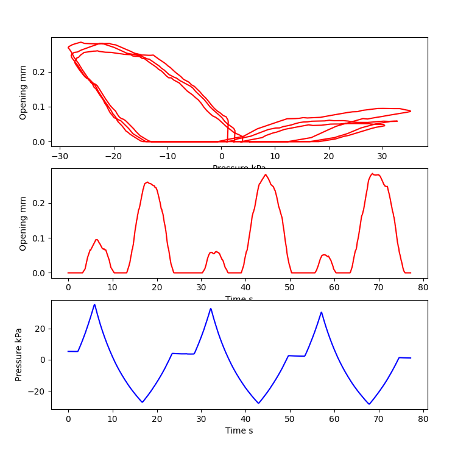

# The record player

The following repository contains useful script for data replaying.

It has several steps.

## Prerequisits:
Python=3.9, but will also work on other
```
pip install -r requirements.txt
```
or manuall install packages
```
pip install matplotlib pandas numpy
```

## Step 1
Firstly, data is stored in `.pkl` format which is a python object. It is done this way because laser scan returns different number of points each time. It is important to view with animation first `-a` argument.
```
python replayer.py -f data_storage_auto_6.pickle -a
```
Data format of pickle(pkl) file:
```
list [
    [...], # list of timestamps
    [...], # list of pressures
    [
        [...], # list of laser points horizontal coordinates 
        [...]  # list of laser points vertical coordinates
    ]
]
```

## Step 2
Initial step was to view the data and now try to set limits for x and y so that only the points of the opening would appear on the screen.

> *-x x_min x_max* and *-y y_min y_max*
```
python replayer.py -f data_storage_auto_6.pickle -a -x -4 -2 -y 6.7 7.5
```
Example:


## Step 3
Now, after the points of interest are captured, we can **remove** `-a` argument to see how the pressure vs opening graphs looks like. 
```
python replayer.py -f data_storage_auto_6.pickle -x -4 -2 -y 6.7 7.5
```
Sample:


## Step 4
I was working in the data the same way, only changing plotting later or combining different data files (like for separate positive and negative pressure), but I added a function to convert pressure vs opening into a csv, just add `-o` and filename:
```
python replayer.py -f data_storage_auto_6.pickle -x -4 -2 -y 6.7 7.5 -o result1.csv
```
